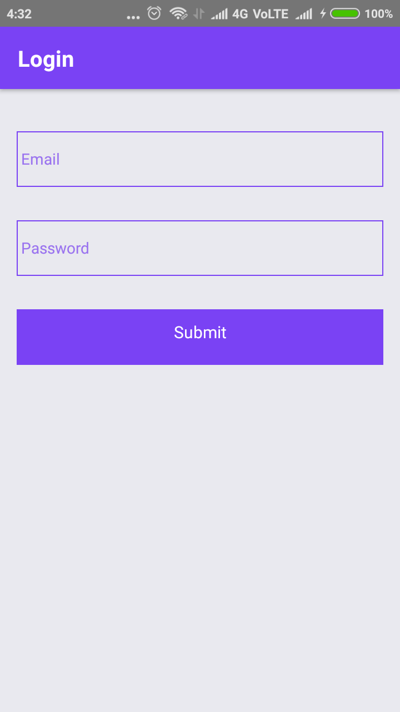
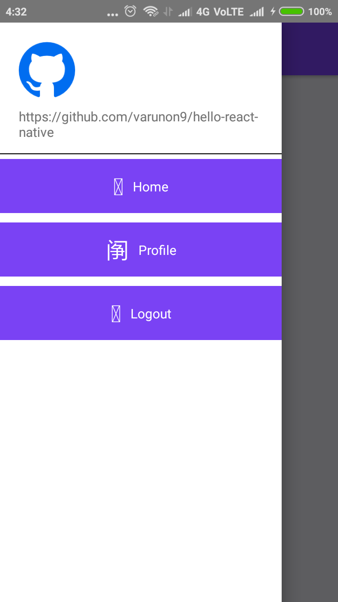
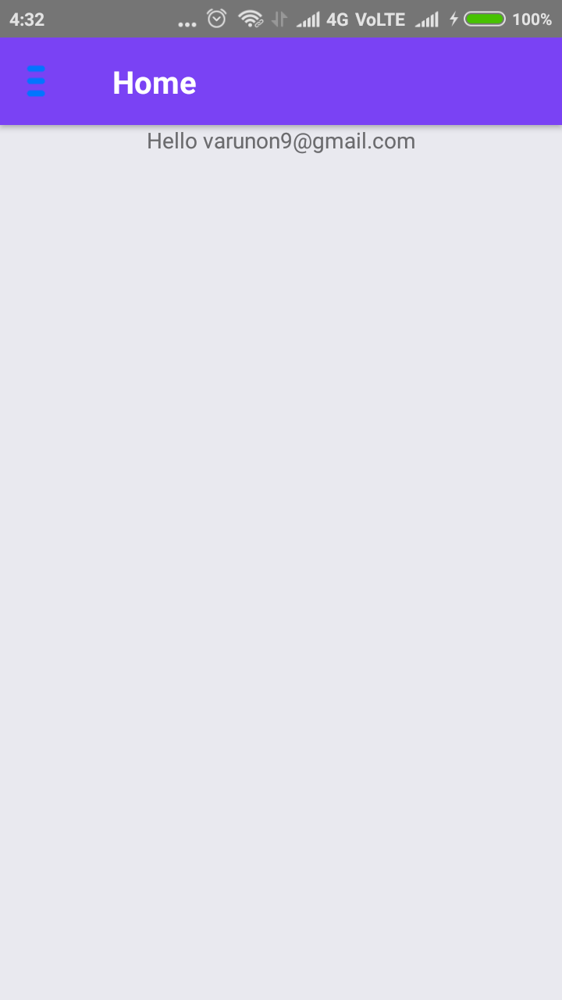
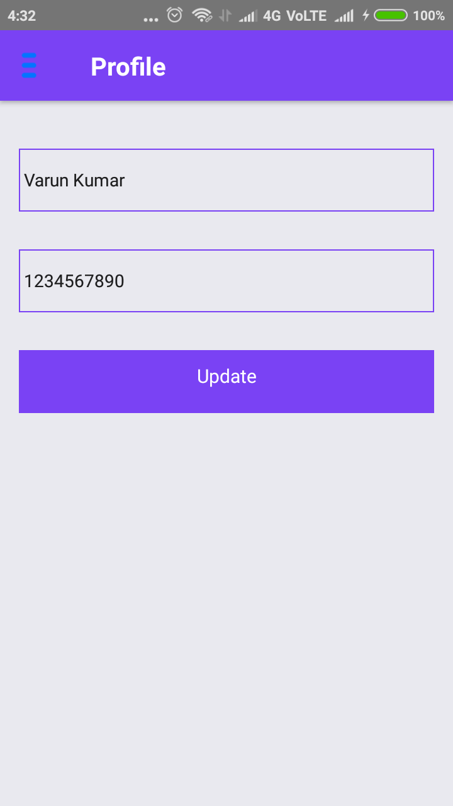

# hello-react-native
Getting started with react-native and redux. Implementing basic login-signup and navigation-drawer

### How to install

1. clone this project `git clone https://github.com/varunon9/hello-react-native.git`
2. `cd hello-react-native`
3. Install dependencies `npm install`
4. Start server `react-native start`
5. If Emulator is running `react-native run-android`

## Screenshots
|  |  |
| --- | --- |
| | |
| | |
